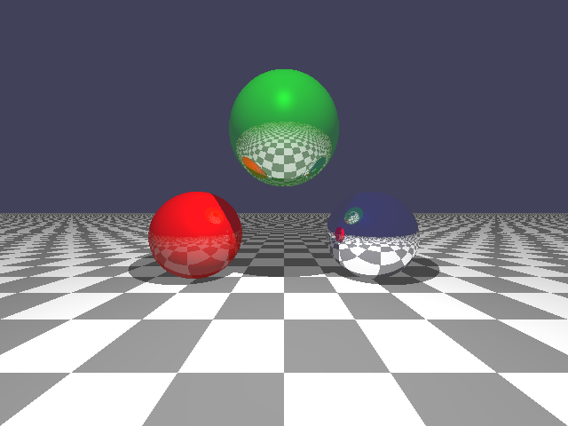

# CgeMath - Lightweight Math Library for C

A compact, dependency-free C library for 2D/3D math, linear algebra, and
computational geometry operations.

## Features

- 2D/3D vector operations: addition, subtraction, scaling, dot product, cross product
- Vector normalization, length computation, linear interpolation (lerp)
- 3x3 and 4x4 matrix operations: multiplication, addition, transpose, inverse, determinant
- Matrix utilities: identity, scaling, translation, rotation (axis and Euler)
- Projection matrices: orthographic, frustum, perspective from FOV
- View matrix from position, target, and up vector
- Quaternion operations: multiplication, conjugate, inverse, slerp, lerp
- Quaternion to/from rotation matrix and Euler angles
- Axis-aligned bounding box (AABB) operations in 2D and 3D: union, intersection, containment
- Point enclosure: compute bounding box from point set
- Line and plane geometry: construction from points, distance to point, closest point
- Ray, segment, and line intersection tests in 2D and 3D
- Ray-triangle and segment-triangle intersection
- Barycentric coordinate computation for 2D and 3D triangles
- Integer vector operations for 2D, 3D, 4D: add, subtract, min, max

## Build Systems

- CMake - supports Linux, macOS, Windows (MSVC, MinGW)
- Makefile.posix - for GCC/Clang on POSIX systems
- Makefile.mingw - for MinGW on Windows
- Makefile.win32 - for MSVC with NMake

Builds a static library. No shared library or external dependencies.

## Usage Example

```c
#include "CgeMath.h"
#include <stdio.h>

int main() {
    float pos[] = {1.0f, 0.0f, 0.0f};
    float scale[] = {2.0f, 2.0f, 2.0f};
    float mat[16], result[3];

    CgeMat4fIdentity(mat);
    CgeMat4fFromScale(scale[0], scale[1], scale[2], mat);
    CgeMat4fApplyVec3f(mat, pos, result);

    printf("Transformed: (%f, %f, %f)\n",
           result[0], result[1], result[2]);
    return 0;
}
```

Checkout the `examples` folder to look at an example of the raytracer using
this library.

Here is an example of its output:



## Portability

- Written in C89 + stdint.h
- No dynamic memory allocation
- No external dependencies

## License

0BSD - a permissive license with no attribution required.
